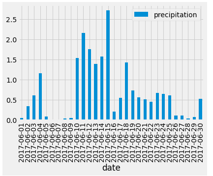
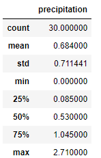
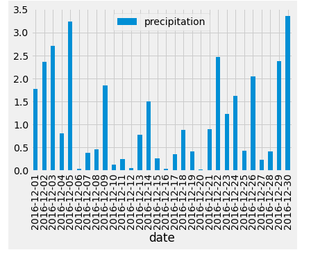
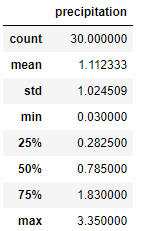

# Surf n' Shake

# Sustainability of a 'Surf & Ice Cream shop' in Hawaii Based on Temperature Data

For this analysis, its been asked to determine the sustainability of opening a surf and ice-cream shop in Hawaii based on the weather. Due to a past failure, an investor had a primary main concern regarding the weather (specifically the rain) and wants to know the summary statistics on the dataset provided - [hawaii.sqlite](hawaii.sqlite)

Results:

The dataset spans from years 2010-2017, and the result of the analysis on the Hawaii dataset resulted in the two below tables:

### Figure 1 - June Temperatures
</img>

### Figure 2 - December Temperatures
</img>

There are three key differences from the two analysis in weather between June and December:
- Average temperatures drop from 75° in June to 71°F in December
- Lowest temperature of 56°F in December while the lowest temperature for June was 64°F
- December's temperature data shows there are a wider range in higher temperatures, as the upper quartile extends further from the mean in comparison to Junes data
    - which could mean there is more variability in higher temps in December, where in June temperatures don't vary and fairly stay the same from year to year

Summary:

Considering temperatures at its lowest in December is still considered fairly good weather for surfing and ice-cream, so based on temperature alone it can be seen as a sustainable business. 

But two additional queries looking at precipitation data for the last year comparing June and December, would be a stronger analysis as this was the main concern of the investor. 

The following is for just one year of data for the months of June and Dec (for 2016 as there is no 2017 dec data), and the precipitation amounts were summed up from all stations for an overall precipitation of hawaii:

### Figure 3 - June Precipitation
</img>
</img>

### Figure 4 - December Precipitation
</img>
</img>

Overall there is more precipitation in December.
Not stated in the dataset but assumed that the precipitation units is in millimeters, on average December has more precipitation compared to June with 1.1mm to 0.68mm respectively. June also has more days without precipitation, but if comparing days with less than 0.5mm, both June and December have nearly the same amount of days.

